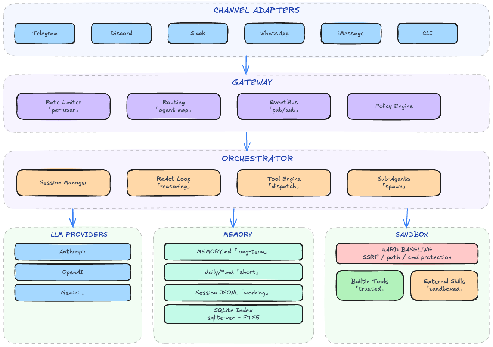

# clawhive

[](https://github.com/longzhi/clawhive/actions/workflows/ci.yml)
[](https://opensource.org/licenses/MIT)
[](https://www.rust-lang.org/)
[](https://github.com/longzhi/clawhive/releases)

An open-source, Rust-native alternative to [OpenClaw](https://github.com/openclaw/openclaw) — deploy your own AI agents across Telegram, Discord, Slack, WhatsApp, iMessage, and more with a single binary.

## Overview

clawhive delivers the personal AI assistant experience of OpenClaw, rebuilt from the ground up in Rust. Where OpenClaw runs on Node.js with 430k+ lines of code, clawhive ships as a **single static binary with zero runtime dependencies** — no Node.js, no npm, no Docker required. Just download, configure, and run.

**Why clawhive over OpenClaw?**

- **Tiny footprint** — One binary, ~14 MB. Runs on a Raspberry Pi, a VPS, or a Mac Mini with minimal resource usage. No garbage collection pauses, predictable memory.
- **Security by design** — Two-layer security model enforced from day one: a non-bypassable hard baseline blocks SSRF, dangerous commands, and sensitive file access system-wide. External skills must declare permissions explicitly — no ambient authority.
- **Bounded execution** — Agents have enforced token budgets, timeout limits, and sub-agent recursion depth. No runaway loops, no surprise bills.
- **Web + CLI setup** — Browser-based setup wizard or interactive CLI. Get your first agent running in under 2 minutes.

## 🔐 Security First

clawhive implements a **two-layer security architecture** that provides defense-in-depth for AI agent tool execution:

### Hard Baseline (Always Enforced)

These security constraints are **non-negotiable** and apply to ALL tool executions, regardless of trust level:

| Protection | What It Blocks |
|------------|----------------|
| **SSRF Prevention** | Private networks (10.x, 172.16-31.x, 192.168.x), loopback, cloud metadata endpoints (169.254.169.254) |
| **Sensitive Path Protection** | Writes to `~/.ssh/`, `~/.gnupg/`, `~/.aws/`, `/etc/`, system directories |
| **Private Key Shield** | Reads of `~/.ssh/id_*`, `~/.gnupg/private-keys`, cloud credentials |
| **Dangerous Command Block** | `rm -rf /`, fork bombs, disk wipes, curl-pipe-to-shell patterns |
| **Resource Limits** | 30s timeout, 1MB output cap, 5 concurrent executions |

### Origin-Based Trust Model

Tools are classified by origin, determining their permission requirements:

| Origin | Trust Level | Permission Checks |
|--------|-------------|-------------------|
| **Builtin** | Trusted | Hard baseline only (no permission declarations needed) |
| **External** | Sandboxed | Must declare all permissions in SKILL.md frontmatter |

### Skill Permission Declaration

External skills must explicitly declare their required permissions in SKILL.md:

```yaml
---
name: weather-skill
description: Get weather forecasts
permissions:
  network:
    allow:
      - "api.openweathermap.org:443"
      - "api.weatherapi.com:443"
  fs:
    read:
      - "${WORKSPACE}/**"
    write:
      - "${WORKSPACE}/cache/**"
  exec:
    - curl
    - jq
  env:
    - WEATHER_API_KEY
---
```

**Any access outside declared permissions is denied at runtime.**

### Security Philosophy

1. **Deny by default** — External skills have no permissions unless explicitly declared
2. **Hard baseline is non-bypassable** — Even misconfigured permissions can't override it
3. **Honest documentation** — We only claim what's implemented, not roadmap intent
4. **Defense in depth** — Multiple layers prevent single-point failures

## Technical Differentiators (vs OpenClaw)

| Aspect | clawhive | OpenClaw |
|--------|----------|----------|
| **Runtime** | Pure Rust binary, embedded SQLite | Node.js runtime |
| **Security Model** | Two-layer policy (hard baseline + origin trust) | Tool allowlist |
| **Permission System** | Declarative SKILL.md permissions | Runtime policy |
| **Memory** | Markdown-native (MEMORY.md canonical) | Markdown-native (MEMORY.md + memory/*.md) |
| **Integration Surface** | Multi-channel (Telegram, Discord, Slack, WhatsApp, iMessage, CLI) | Broad connectors |
| **Dependency** | Single binary, no runtime deps | Node.js + npm |

### Key Architectural Choices

- **Rust workspace with embedded SQLite** (`rusqlite` + bundled): zero runtime dependencies in production
- **Markdown-first memory**: `MEMORY.md` and daily files are canonical; SQLite index is rebuildable
- **Permission-as-code**: Skills declare permissions in YAML frontmatter, enforced at runtime
- **Bounded execution**: Token-bucket rate limits, sub-agent recursion limits, timeouts

## Features

- Multi-agent orchestration with per-agent personas, model routing, and memory policy controls
- Three-layer memory system: Session JSONL (working memory) → Daily files (short-term) → MEMORY.md (long-term)
- Hybrid search: sqlite-vec vector similarity (70%) + FTS5 BM25 (30%) over memory chunks
- Hippocampus consolidation: periodic LLM-driven synthesis of daily observations into long-term memory
- Channel adapters: Telegram, Discord, Slack, WhatsApp, iMessage (multi-bot, multi-connector)
- ReAct reasoning loop with repeat guard
- Sub-agent spawning with depth limits and timeout
- Skill system (SKILL.md with frontmatter + prompt injection)
- Token-bucket rate limiting per user
- LLM provider abstraction with retry + exponential backoff (Anthropic, OpenAI, Gemini, DeepSeek, Groq, Ollama, OpenRouter, Together, Fireworks, and any OpenAI-compatible endpoint)
- Real-time TUI dashboard (sessions, events, agent status)
- YAML-driven configuration (agents, providers, routing)

## Architecture



## Project Structure

```
crates/
├── clawhive-cli/        # CLI binary (clap) — start, setup, chat, validate, agent/skill/session/schedule
├── clawhive-core/       # Orchestrator, session mgmt, config, persona, skill system, sub-agent, LLM router
├── clawhive-memory/     # Memory system — file store (MEMORY.md + daily), session JSONL, SQLite index, chunker, embedding
├── clawhive-gateway/    # Gateway with agent routing and per-user rate limiting
├── clawhive-bus/        # Topic-based in-process event bus (pub/sub)
├── clawhive-provider/   # LLM provider trait + multi-provider adapters (streaming, retry)
├── clawhive-channels/   # Channel adapters (Telegram, Discord, Slack, WhatsApp, iMessage)
├── clawhive-auth/       # OAuth and API key authentication
├── clawhive-scheduler/  # Cron-based task scheduling
├── clawhive-server/     # HTTP API server
├── clawhive-schema/     # Shared DTOs (InboundMessage, OutboundMessage, BusMessage, SessionKey)
├── clawhive-runtime/    # Task executor abstraction
└── clawhive-tui/        # Real-time terminal dashboard (ratatui)

~/.clawhive/             # Created by install + setup
├── bin/                 # Binary
├── skills/              # Skill definitions (SKILL.md with frontmatter)
├── config/              # Generated by `clawhive setup`
│   ├── main.yaml        # App settings, channel configuration
│   ├── agents.d/*.yaml  # Per-agent config (model policy, tools, memory, identity)
│   ├── providers.d/*.yaml # LLM provider settings
│   └── routing.yaml     # Channel → agent routing bindings
├── workspaces/          # Per-agent workspace (memory, sessions, prompts)
├── data/                # SQLite databases
└── logs/                # Log files
```

## Installation

```bash
curl -fsSL https://raw.githubusercontent.com/longzhi/clawhive/main/install.sh | bash
```

Auto-detects OS/architecture, downloads latest release, installs binary and skills to `~/.clawhive/`.

After installation, restart your shell or run:

```bash
source ~/.zshrc  # or ~/.bashrc
```

Or download manually from [GitHub Releases](https://github.com/longzhi/clawhive/releases).

### Setup

After installation, configure providers, agents, and channels using either method:

**Option A: Web Setup Wizard** — Start the server and open the browser-based wizard:

```bash
clawhive start
# Open http://localhost:8848/setup in your browser
```

**Option B: CLI Setup Wizard** — Run the interactive terminal wizard:

```bash
clawhive setup
```

### Run

```bash
# Setup / config
clawhive setup
clawhive validate

# Chat mode (local REPL)
clawhive chat

# Service lifecycle
clawhive start
clawhive start --daemon  # alias: -d
clawhive restart
clawhive restart --daemon  # alias: -d
clawhive stop

# Dashboard mode (observability TUI)
clawhive dashboard
clawhive dashboard --port 8848

# Code mode (developer TUI)
clawhive code
clawhive code --port 8848

# Agents / sessions
clawhive agent list
clawhive agent show clawhive-main
clawhive session reset <session_key>

# Schedules / tasks
clawhive schedule list
clawhive schedule run <schedule_id>
clawhive task trigger clawhive-main "summarize today's work"

# Auth
clawhive auth status
clawhive auth login openai
```

## Quick Start (Developers)

Prerequisites: Rust 1.92+

```bash
# Clone and build
git clone https://github.com/longzhi/clawhive.git
cd clawhive
cargo build --workspace

# Interactive setup (configure providers, agents, channels)
cargo run -- setup

# Chat mode (local REPL)
cargo run -- chat

# Start all configured channel bots
cargo run -- start

# Start as background daemon
cargo run -- start --daemon  # alias: -d

# Restart / stop
cargo run -- restart
cargo run -- restart --daemon
cargo run -- stop

# Dashboard mode (observability TUI)
cargo run -- dashboard
cargo run -- dashboard --port 8848

# Coding agent mode (attach local TUI channel to running gateway)
cargo run -- code
cargo run -- code --port 8848
```

## Developer Workflow

Use local quality gates before pushing:

```bash
# One-time: install repo-managed git hooks
just install-hooks

# Run all CI-equivalent checks locally
just check

# Release flow: check -> push main -> replace tag and push tag
just release v0.1.0-alpha.15
```

If you don't use `just`, use scripts directly:

```bash
bash scripts/install-git-hooks.sh
bash scripts/check.sh
bash scripts/release.sh v0.1.0-alpha.15
```

`just check` runs:

1. `cargo fmt --all -- --check`
2. `cargo clippy --workspace --all-targets -- -D warnings`
3. `cargo test --workspace`

## Configuration

Configuration is managed through `clawhive setup`, which interactively generates YAML files under `~/.clawhive/config/`:

- `main.yaml` — app name, runtime settings, feature flags, channel config
- `agents.d/<agent_id>.yaml` — agent identity (name, emoji), model policy (primary + fallbacks), tool policy, memory policy
- `providers.d/<provider>.yaml` — provider type, API base URL, authentication (API key or OAuth)
- `routing.yaml` — default agent ID, channel-to-agent routing bindings

Supported providers: Anthropic, OpenAI, Gemini, DeepSeek, Groq, Ollama, OpenRouter, Together, Fireworks, and any OpenAI-compatible endpoint.

## Memory System

clawhive uses a three-layer memory architecture inspired by neuroscience:

1. **Session JSONL** (`sessions/<id>.jsonl`) — append-only conversation log, typed entries (message, tool_call, tool_result, compaction, model_change). Used for session recovery and audit trail.
2. **Daily Files** (`memory/YYYY-MM-DD.md`) — daily observations written by LLM during conversations. Fallback summary generated if LLM didn't write anything in a session.
3. **MEMORY.md** — curated long-term knowledge. Updated by hippocampus consolidation (LLM synthesis of recent daily files) and direct LLM writes.
4. **SQLite Search Index** — sqlite-vec 0.1.6 + FTS5. Markdown files chunked (~400 tokens, 80 token overlap), embedded, indexed. Hybrid search: vector similarity × 0.7 + BM25 × 0.3.

Note: JSONL files are NOT indexed (too noisy). Only Markdown memory files participate in search.

## CLI Commands

| Command | Description |
|---------|-------------|
| `setup` | Interactive configuration wizard |
| `start [--tui] [--daemon]` | Start all configured channel bots and HTTP API server |
| `stop` | Stop a running clawhive process |
| `restart` | Restart clawhive (stop + start) |
| `chat [--agent <id>]` | Local REPL for testing |
| `validate` | Validate YAML configuration |
| `consolidate` | Run memory consolidation manually |
| `agent list\|show\|enable\|disable` | Agent management |
| `skill list\|show\|analyze\|install` | Skill management |
| `session reset <key>` | Reset a session |
| `schedule list\|run\|enable\|disable\|history` | Scheduled task management |
| `wait list` | List background wait tasks |
| `task trigger <agent> <task>` | Send a one-off task to an agent |
| `auth login\|status` | OAuth authentication management |

## Development

```bash
# Run all tests
cargo test --workspace

# Lint
cargo clippy --workspace --all-targets -- -D warnings

# Format
cargo fmt --all
```

## Tech Stack

| Component | Technology |
|-----------|-----------|
| Language | Rust (2021 edition) |
| LLM Providers | Anthropic, OpenAI, Gemini, DeepSeek, Groq, Ollama, OpenRouter, Together, Fireworks |
| Channels | Telegram, Discord, Slack, WhatsApp, iMessage, CLI |
| Database | SQLite (rusqlite, bundled) |
| Vector Search | sqlite-vec |
| Full-Text Search | FTS5 |
| HTTP | reqwest |
| Async | tokio |
| TUI | ratatui + crossterm |
| CLI | clap 4 |

## License

MIT

## Status

This project is under active development. The memory architecture uses Markdown-native storage + hybrid retrieval.
